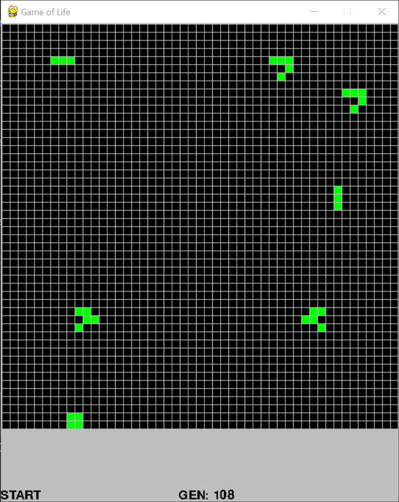

# Conway's Game of Life

A simple implementation of Conway's Game of Life in Python 3.5. 

### How to Run
0. ensure that python 3.5 and pygame are installed
1. run GameOfLife.py

### How to Play
On start up, the user may place whatever patterns they wish on the grid. 

After hitting START in the bottom left, the cellular automaton rules are applied to the pattern over successive generations. 

The user may pause the game by hitting STOP in the bottom left. Once paused, they can modify the patterns and add new ones. 

